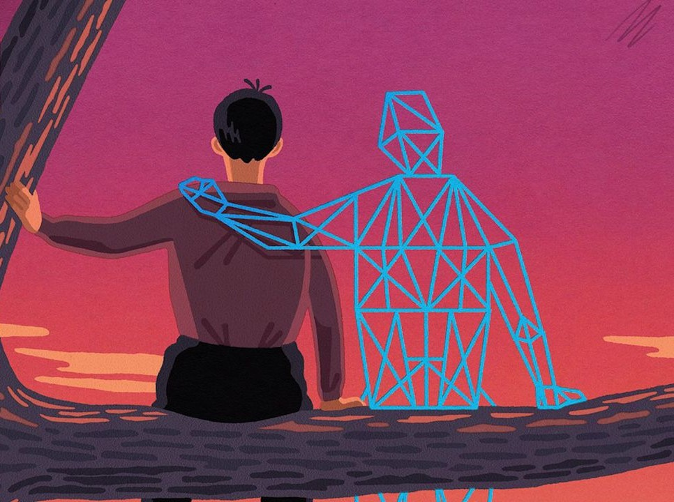

  

### Looking Back
Without a doubt, ICS 314 is one of those classes where you would think back about and say, "Man, I really did learn a lot." With the semester ending, I believe I am a better person, socially and as a programmer. I learned new concepts and techniques with a chance to apply them all in my final project for ICS 314. 

### Coding Standards
