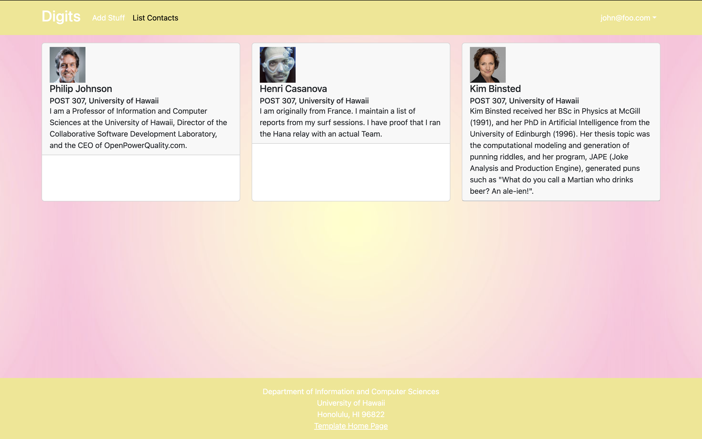

## You Can't Build Without Your Tools
Design Patterns is a very important concept in Software Engineering. Without it, programmers like me will frequently run into trouble whenever we try to solve common problems in software design. For those who have never heard about design patterns, think of them like tools in a construction workers toolbox. Let's picture a construction worker (programmer) who needs to build a signpost (design code). There is a problem. They need to nail the sign onto the actual post. Having to nail an object onto something is a very common problem in construction. Good thing we have our toolbox (design patterns) to help us find the solution. We use the hammer as our solution to our nailing problem and the sign is finally nailed onto the post. What I am trying to say with this example is that design patterns are tools that we can use over and over again to solve common problems in software design.

