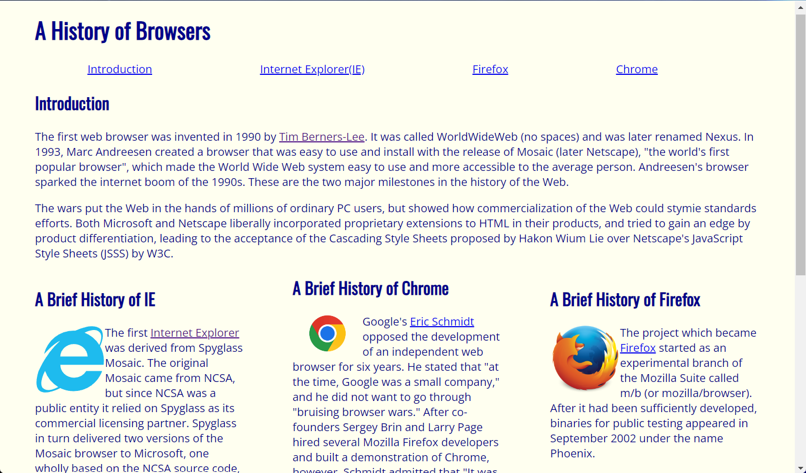
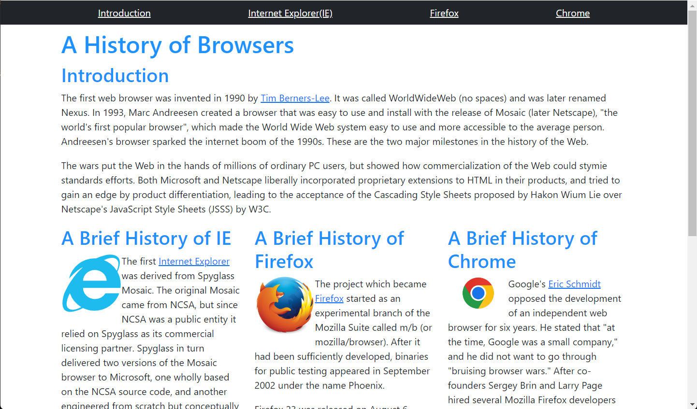

## HTML, CSS, Bootstrap 5, and Frustration
HTML and CSS are what make a website, a website. These two markup languages make every website that is on the internet. These "languages" are not even that hard to learn. When first introduced to HTML and CSS in high school, I was amazed by how easy it was to create your website. It was like painting your picture using computer commands. On the other hand, Bootstrap 5 has given me an experience that was quite the opposite of what I had with HTML/CSS. So much so that I nearly gave up my thought of trying out web development.

## Strapping on my Boots
Bootstrap 5 is a framework tool that helps you build your websites easily using less code. My problem with Bootstrap 5 is that it took a while to learn how it worked. To me, it felt like learning a whole new language. Back to my painting example, instead of painting using a brush and canvas, you create a drawing using a tablet and a stylus. It will take a bit to get used to and learn all the functionalities. 

However, the claim that it helps you build your websites easily using less code still stands. I was tasked to create a website about the history of internet browsers using raw HTML/CSS and replicate it using Bootstrap 5 under a time limit. It took me about three attempts to complete the task using HTML/CSS while it took only two attempts when using Bootstrap 5. I had an incredibly hard time creating three columns in line with each other on my website using raw HTML/CSS. With Bootstrap 5, it took several lines of code and I was done. If I were to create this website again using the experience I have with Bootstrap 5 now, I would be able to complete it on my first attempt.

Here are the two websites that I previously mentioned. *HTML/CSS (left) and Bootstrap 5 (right)*

As you can see
